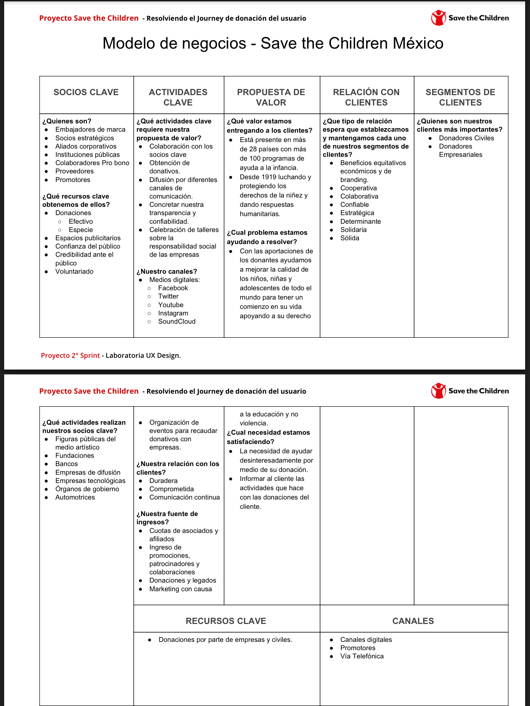
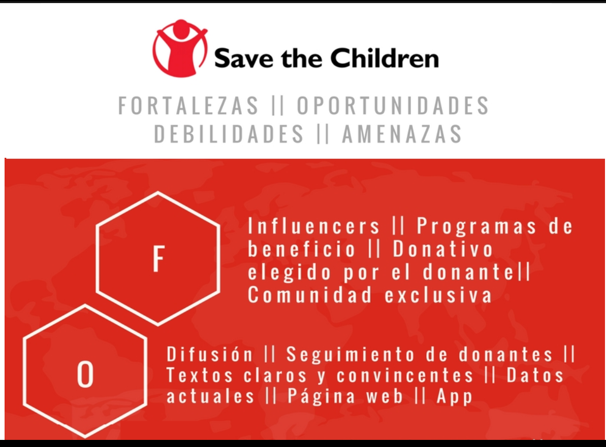
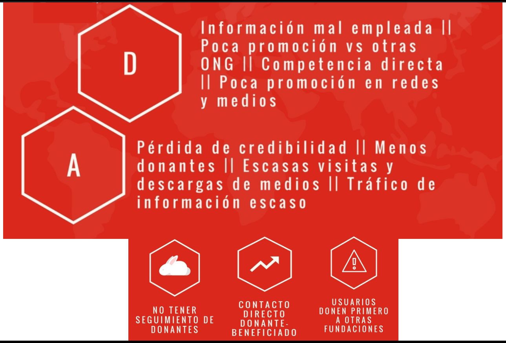
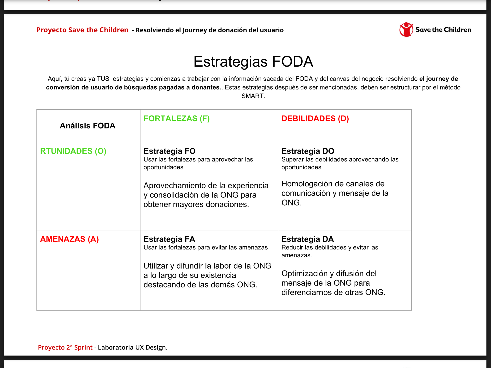
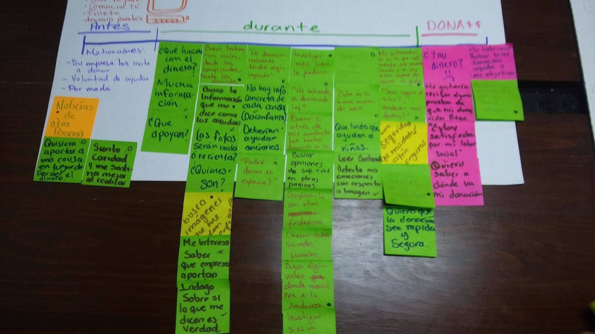

* **Especialidad:** UX Designer
* **Sprint 05** 
* **Duración:** 3 semanas
* **Mentor:** Camilo Salazar Paris y Karla Nava M.
* **Team:** 

    - Brenda Milián **Product Owner**
    - Viridiana Montoya **UX Designer**
    - Andrea Gutierrez **UX Designer**
    - Karina Becerra **UX Research**
    - Nancy Ortega **UX Research** 

El objetivo del sprint es crear una solución para optimizar el journey de un usuario que llega a landingPage de Save The Children.

## Problema

Se acercó a nosotros el __ de la organización Save The Children para encontrar la manera de aumentar el número de conversiones a través de la optimización de una landingPage, esto debido a que sólo el .5% de los visitantes en landinPage se convierte en donante por lo que urge una reestructuración en este canal de ingreso de donantes.

Teniendo clara la dolencia del cliente, comenzamos a investigar y entender el modelo de negocio de Save the children a través de la contrucción del **Bussines Model Canva**

## Proceso 

Para tener una mejor organización de las actividades a realizar durante el proceso, utilizamos la herramientas de **Google Smarh Sheets** que sirve perfecto para la asignación, control, esfuerzo y tiempos de tareas para el team.

## Definiendo Objetivo de Negocio

Después de analizar y entender a nuestro cliente y como funciona la organización, nos dimos a la tarea de profundizar en las áreas de oportunidad y así poder tener claro cuál será nuestro objetivo e ir planeando estrategias para realizarlo.

**FODA**

El FODA es una herramienta que nos ayudó a identificar cuales eran exactamente las Fortalezas, Oportunidades, Debilidades y Amenanzas de Save The Children

**ESTRATEGIAS FODA**

**OBJETIVO SMART**

Ya que hicimos la descripción de las estrategias, ahora definiremos el objetivo SMART

+ **SPECIFIC** Optimizar únicamente el canal de conversiones, landingPage

* **MEASURABLE**
Porcentaje de donaciones

* **ATTAINABLE** Ya que el porcentaje de conversioneses de .5% nuestro objetivo intenta aumentarlo a 10% por lo que creemos que es totalmente alcanzable.

* **RELEVANT** Con esta estrategia aumentaremos radicalemente el número de donaciones, cumpliendo el objetivo de negocio.

* **TIME** En un periodo de 3 meses haremos que sea posible este incremento.

## **OBJETIVO DE NEGOCIO**

Con lo anterior, nuestro objetivo final será
"Optimizar el contenido y diseño digital de la landingPage para que en un periodo de 3 meses, aumentemos en un 10% el numero de donaciones"

## DEFINIENDO OBJETIVO DE USUARIO

A continuación toca entender cuales son las acciones que están impiendiendo que el usuario no done a la fundación a pesar de lo importante que es rescatar a la niñez. Para esto nos apoyaremos de las siguientes herramientas;

**CUSTOMER JOURNEY MAP**

**MAPA DE EMPATÍA**

**USER PERSONA**

## **OBJETIVO DE USUARIO**

Tener una retribución emocional a través de una donación segura y confiable.

